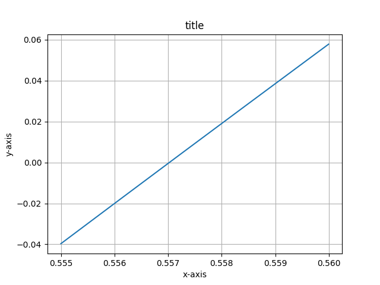
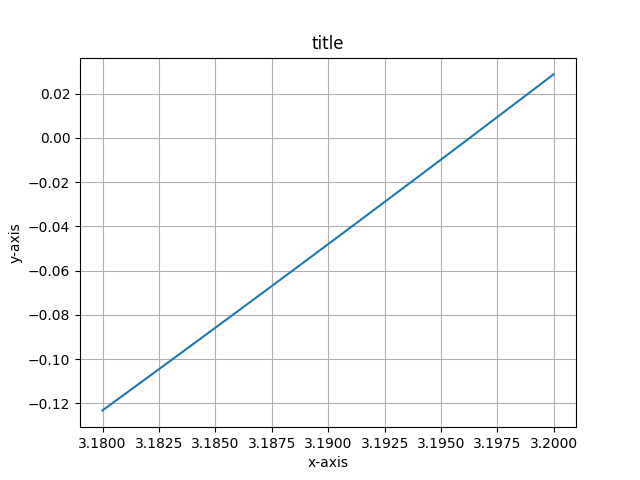

# Assignment Hands On Module 4

## Meta-Info

- Course: CISC600-90-O
- Semester: Spring 2025
- Student Name: Akassh Shah

## Assignment Instructions

Solve any two (2) even-numbered (4.2, 4.4, 4.6, etc.) questions from chapter 4 (pages 110-111). Analyze your results. You can use python or any other programming language to aid in your calculations. If you use python, you can use the _series.py module created for Module 4. (Note: If your solution includes source code, please upload it in a separate file). If you need guidance, please post to the Discussions section directly so that other participants can benefit from the answers.

## Assignment

For this assignment, I have chosen to solve the following problems

### 5.2

Determine the real root of `f(x) = -26 + (85 * x) + (-91 * (x**2)) + (44 * (x**3)) + (-8 * (x**4)) + (x**5)`

(a) graphically

As shown in class, and the attached py file, we can see that graphically it means to understand intersection points.



We can inspect graphically and see that the real root lies somewhere close to `0.557`.

(b) Using bisection to locate the root to Es ~ 10%. Employ initial guesses of xl = 0.5 and xu = 1.0.

Here we can see that the initial coniditions were set up just right for the bisect method to find the root with an acceptable es100.

(c) Perform the same computation but use false position method and Es ~ 0.2%.


### 6.2

Determine the highest real root of `f(x) = (2.1 * (x**3)) + (-11.6 (x**2)) + (17.5 * x) - 6`

(a) Graphically



Graphically, we can that the highest root appears to be close to 3.196

(b) Fixed point iteration method (three iterations, x0 = 3) (must converge on root)

(c) Newton-Raphson method (three iterations, x0=3)

(d) Secant method (three iterations, x-1=3, x0=4)

(e) Modified secant method (three iterations, x0=3, d=0.01)

Compute the approximate relative erros for your solutions

As provided in the output file, we can see that they all get close to the answer, but the most efficient seems to be the newton method, at least for this problem.

BTW professor, in my research i came across this: https://en.wikipedia.org/wiki/Fast_inverse_square_root
this also uses the newton method. The code for it looks pretty cool! Check it out for sure!

## How to run code

```bash
python3.13 ./hands_on_module_4.py > hands_on_module_4.output.txt
```
